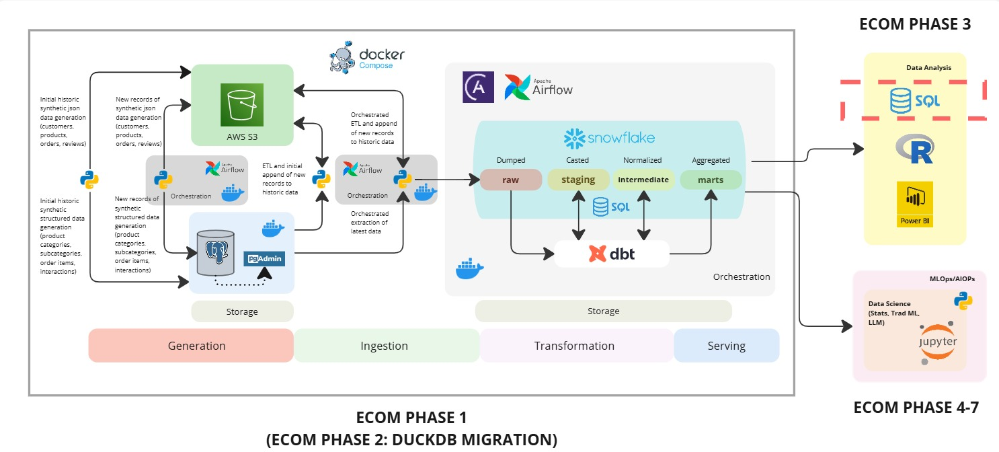
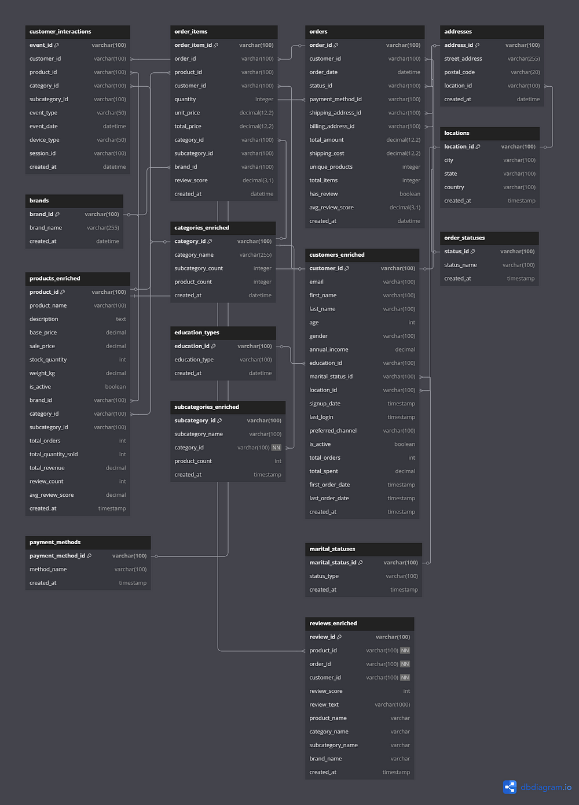

## ECOM Phase 3 - Part 1: Unlocking Business Value with SQL

### Overview

In today's data-driven e-commerce landscape, understanding customer behavior, product performance, and sales and revenue trends is critical for business success. SQL has emerged as the language of choice for data analysts looking to extract meaningful insights from vast amounts of transaction data. In this article, I'll walk through several powerful e-commerce analytics techniques using SQL, explaining what each analysis does, why it's essential, how to implement it, and the valuable insights it can reveal.
This article is built on top of [ECOM Phase 1: Build an End-to-End Data Engineering Pipeline for eCommerce with a Modern Data Stack](https://medium.com/@sclauguico/build-an-end-to-end-data-engineering-pipeline-for-ecommerce-with-a-modern-data-stack-e874d89b9906) ([GitHub Repository](https://github.com/sclauguico/ecommerce-modern-data-stack)), with a specific focus on the section highlighted by the dashed red box in the diagram below.

As such, the SQL queries showcased here are run against the intermediate model created in that phase. You can find the SQL files referenced in this article in the accompanying GitHub repository. The data used in this article are entirely fictional, generated using the Faker Python package and statistical distributions.

